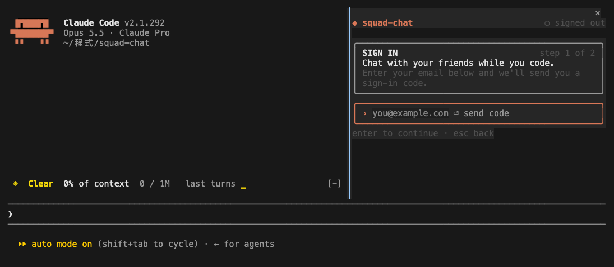
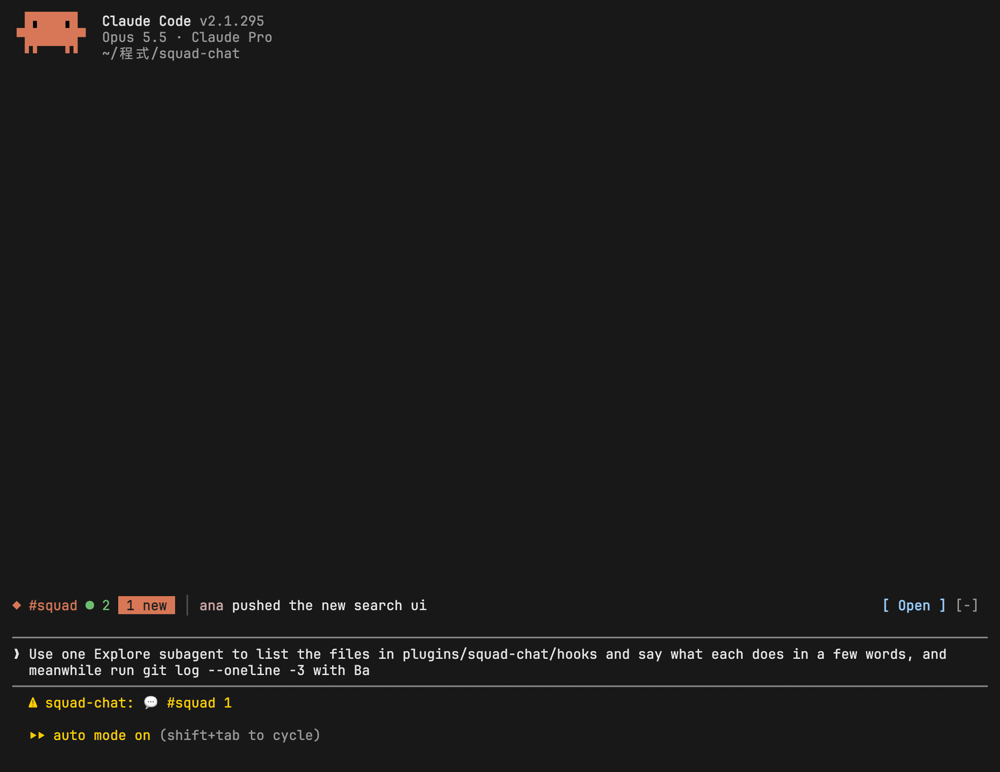
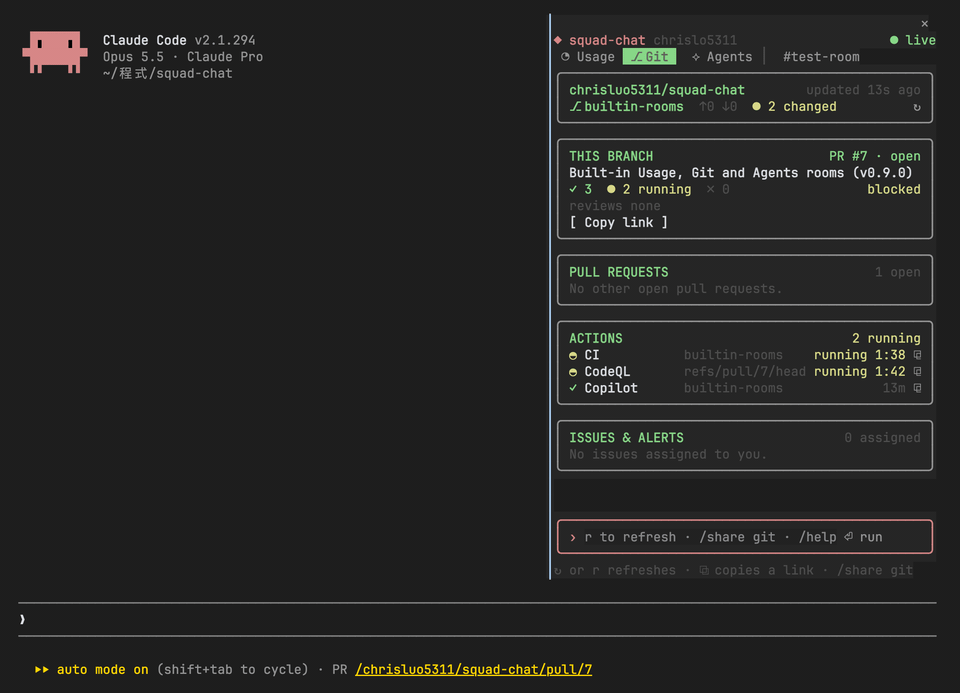
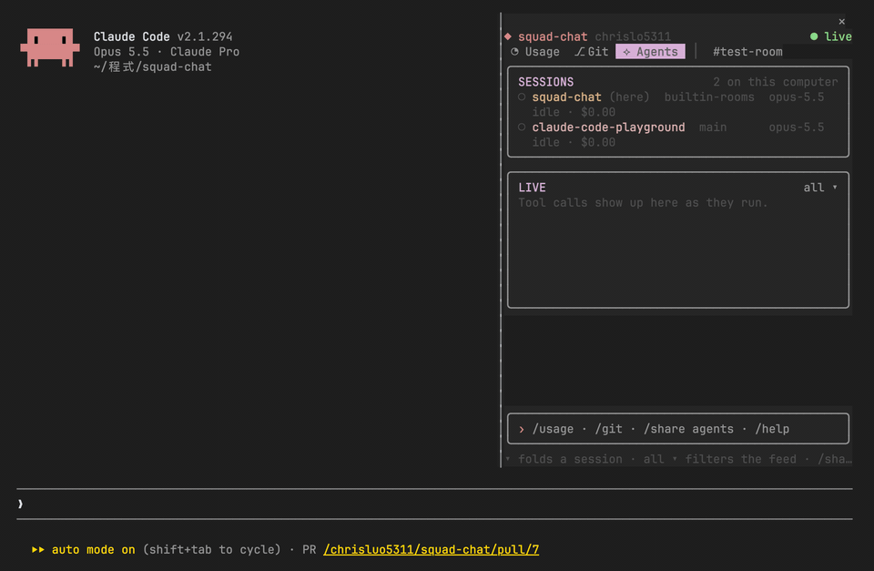
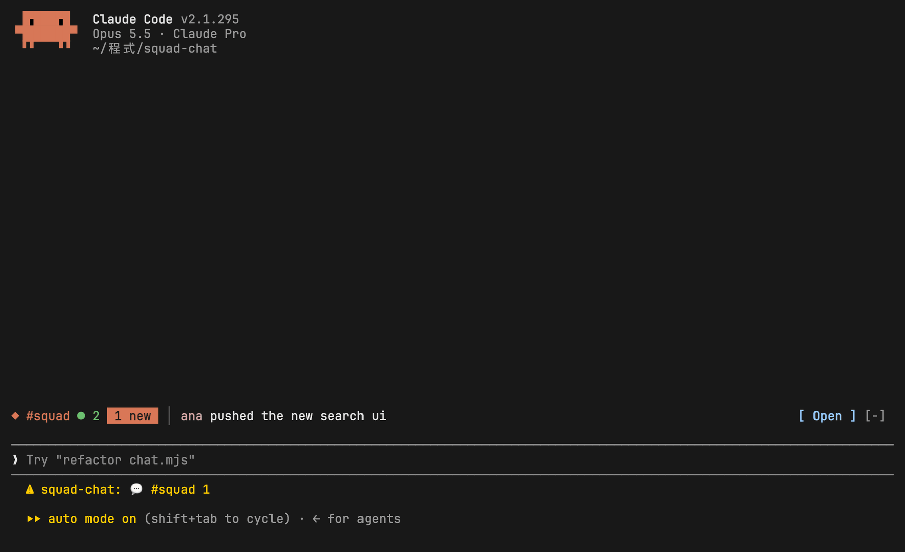
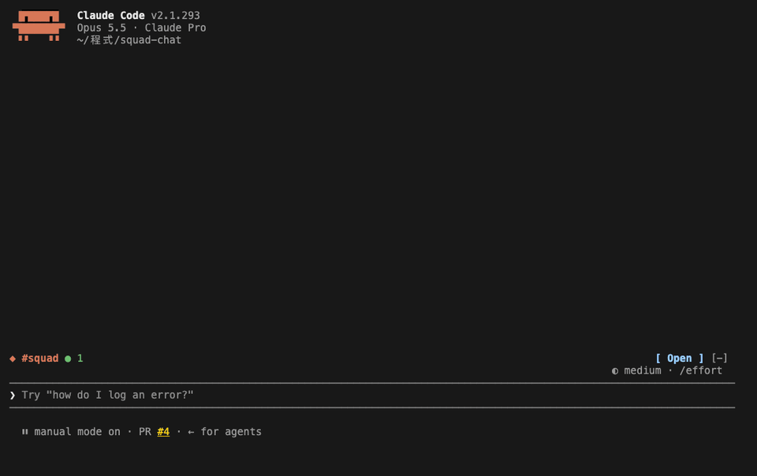
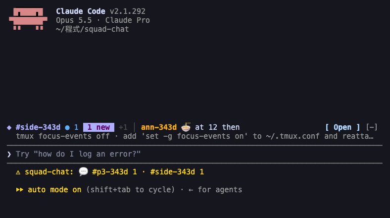

<a id="readme-top"></a>

<div align="center">

[![Stars][stars-shield]][stars-url]
[![Version][version-shield]][version-url]
[![CI][ci-shield]][ci-url]
[![License][license-shield]][license-url]
[![Made for Claude Code][made-for-shield]][made-for-url]
[![Node][node-shield]][node-url]
[![Views][views-shield]][views-url]

<br />

<a href="https://github.com/chrisluo5311/squad-chat">
  
</a>

<h1 align="center">squad-chat</h1>

<p align="center">
  <strong>Claude's cooking. Chat with your squad.</strong>
  <br />
  Friends online, right beside your Claude Code session. Zero tokens, zero leaks to Claude.
  <br />
  <a href="https://chrisluo5311.github.io/squad-chat/"><strong>Read the docs »</strong></a>
  <br />
  <br />
  <a href="#about-the-project">View Demo</a>
  ·
  <a href="https://github.com/chrisluo5311/squad-chat/issues/new?labels=bug">Report Bug</a>
  ·
  <a href="https://github.com/chrisluo5311/squad-chat/issues/new?labels=enhancement">Request Feature</a>
</p>

</div>

<details>
  <summary>Table of Contents</summary>
  <ol>
    <li>
      <a href="#about-the-project">About The Project</a>
      <ul>
        <li><a href="#built-with">Built With</a></li>
      </ul>
    </li>
    <li>
      <a href="#getting-started">Getting Started</a>
      <ul>
        <li><a href="#prerequisites">Prerequisites</a></li>
        <li><a href="#installation">Installation</a></li>
        <li><a href="#connect-to-a-server">Connect to a server</a></li>
      </ul>
    </li>
    <li>
      <a href="#usage">Usage</a>
      <ul>
        <li><a href="#first-run">First run</a></li>
        <li><a href="#built-in-rooms">Built-in rooms</a></li>
        <li><a href="#commands">Commands</a></li>
        <li><a href="#layouts">Layouts</a></li>
        <li><a href="#two-accounts-on-one-computer">Two accounts on one computer</a></li>
      </ul>
    </li>
    <li><a href="#host-your-own-server">Host your own server</a></li>
    <li><a href="#license">License</a></li>
    <li><a href="#acknowledgments">Acknowledgments</a></li>
  </ol>
</details>

## About The Project

https://github.com/user-attachments/assets/b83d9a2c-673a-40d0-90a3-a2c717b6c79a

<div align="center">
  <sub>Chatting with the squad while Claude runs a subagent, then the Agents, Usage and Git rooms, and a Usage snapshot shared to the room.</sub>
</div>

<br />

squad-chat puts a group chat next to your Claude Code conversation. You keep working with Claude on the left while your friends' messages come in on the right.

* **Lives inside Claude Code.** One `/chat` command opens a pane: no browser tab, no extra app.
* **Never reaches Claude.** What you type in the pane never enters the conversation, and slash-command arguments are hidden from the model, so chatting costs no tokens.
* **Share code and diffs.** Post the code you selected, Claude's last code block or your `git diff` to the room as a card your friends can copy, without copying and pasting.
* **Presence across rooms.** See who's online in every room you share and who's typing, with a status line for unread messages, an optional toast when someone @mentions you, and a do-not-disturb mode for when Claude is busy.
* **Your own server.** Each group of friends runs its own free Supabase project. There is no central service and no account with us.
* **Private rooms.** Rooms are joined with a passcode, and the database only shows a room's messages to its members.
* **Survives bad networks.** After a dropped connection, a closed laptop or a crashed process, it reconnects by itself and fetches exactly the messages you missed.
* **Built-in rooms for your session.** Next to the chat rooms, the Usage, Git and Agents tabs show context fill, cost, rate limits and tool timings, your pull requests and CI, and every Claude Code session's subagents as they work. They need no server and no sign-in.
* **Fits any terminal.** Docked beside the transcript in a wide terminal, compact above the prompt in a narrow one, and a one-line summary when the pane is closed.

It is a Claude Code mod: a plugin of function hooks, plus a small Node process that holds the connection to Supabase. [docs/ARCHITECTURE.md](docs/ARCHITECTURE.md) explains how the pieces fit.

The full guide, with search, lives at **[chrisluo5311.github.io/squad-chat](https://chrisluo5311.github.io/squad-chat/)**. [Privacy & security](https://chrisluo5311.github.io/squad-chat/reference/privacy/), [development](https://chrisluo5311.github.io/squad-chat/reference/development/) and the [roadmap](https://chrisluo5311.github.io/squad-chat/reference/roadmap/) are there too. Found a security problem? Please report it privately, as described in [SECURITY.md](SECURITY.md).

<p align="right">(<a href="#readme-top">back to top</a>)</p>

### Built With

[![JavaScript][js-shield]][js-url]
[![Node.js][nodejs-shield]][nodejs-url]
[![Supabase][supabase-shield]][supabase-url]
[![PostgreSQL][postgres-shield]][postgres-url]
[![esbuild][esbuild-shield]][esbuild-url]
[![Resend][resend-shield]][resend-url]

<p align="right">(<a href="#readme-top">back to top</a>)</p>

## Getting Started

### Prerequisites

* Claude Code 2.1.287 or newer, in the terminal. The desktop app can't start the chat's background process yet.
* Node 22 or newer on your `PATH`:
  ```sh
  node --version
  ```
* A server: one Supabase project per group of friends. Get its URL and key from whoever hosts it, or [host one yourself](#host-your-own-server).
* A terminal with truecolor, such as iTerm2, Ghostty, kitty or WezTerm.
* For the side-by-side layout: Claude Code's fullscreen layout (`/tui fullscreen`) and a terminal at least 110 columns wide.

> [!NOTE]
> Claude Code decides where the pane goes, not the mod. Below 110 columns the pane opens above the prompt in a compact layout. While it's closed, a one-line summary sits above the prompt with an **Open** button.

### Installation

The repository is its own plugin marketplace.

1. Add the marketplace and install the plugin:
   ```sh
   claude plugin marketplace add chrisluo5311/squad-chat
   claude plugin install squad-chat@squad-chat
   ```
   Or, from inside Claude Code:
   ```
   /plugin install squad-chat --marketplace chrisluo5311/squad-chat
   ```
2. Restart Claude Code, or run `/reload-plugins`.
3. [Connect to a server](#connect-to-a-server), then open the pane with `/chat`.

To update later:

```sh
claude plugin marketplace update squad-chat && claude plugin update squad-chat@squad-chat
```

If you host your group's server, also run `supabase db push` again from an updated clone, so the server has what the new version needs. For example, shared snippets need 0.7.0's database change.

To uninstall:

```sh
claude plugin uninstall squad-chat@squad-chat && claude plugin marketplace remove squad-chat
```

To try it without installing:

```sh
git clone https://github.com/chrisluo5311/squad-chat.git
claude --plugin-dir ./squad-chat/plugins/squad-chat
```

### Connect to a server

squad-chat has no central server. Each group of friends shares one Supabase project, its *server*: one person [hosts it](#host-your-own-server) on Supabase's free plan, and everyone else connects with two values from them:

* the project URL, such as `https://abcd1234.supabase.co`
* the project's **publishable** key, `sb_publishable_…` (safe to share, unlike the secret key, which you never share)

Set them when you install:

```sh
claude plugin install squad-chat@squad-chat \
  --config supabase_url=https://abcd1234.supabase.co \
  --config supabase_key=sb_publishable_...
```

or later, from `/config` in Claude Code (squad-chat's options), or from a shell:

```sh
echo '{"supabase_url":"https://abcd1234.supabase.co","supabase_key":"sb_publishable_..."}' \
  | claude plugin configure squad-chat@squad-chat --values-stdin
```

Until a server is set, the pane says so and shows these steps.

<p align="right">(<a href="#readme-top">back to top</a>)</p>

## Usage

### First run

1. `/chat` opens the pane.
2. Sign in, depending on how your server is set up:
   * **With a name:** type the name you want and press Enter. That's it.
   * **With your email:** type your email and press Enter, then type the code from the email.
3. Create a room and give its name and passcode to your friends. Type this in the pane:
   ```
   /room our-team some-passcode
   ```
   Your friends join with the same line.
4. Chat: type in the pane and press Enter. Esc goes back to the prompt.

> [!IMPORTANT]
> **An account made with just a name can't be recovered.** It has no email, so once you sign out, delete `~/.config/squad-chat` or switch computers, you can't sign back into it. Signing in again makes a new account: rejoin your rooms with their passcodes and you'll see their history again. Messages from the old account stay in the rooms until they expire after 30 days. Signing in by email doesn't have this problem.

<div align="center">
  
</div>

<br />

### Built-in rooms

Three tabs sit before your chat rooms: **◔ Usage**, **⎇ Git** and **⟡ Agents**. They need no server and no sign-in, and nothing in them leaves your computer unless you share it. Each tab has its own color and a badge when something there is worth a look, such as a red dot on Git when this branch's checks fail.

Open one with `/chat usage`, `/chat git` or `/chat agents`, or press its tab. While the pane is closed, the line above the prompt sums up the room you were last in.

#### ◔ Usage

How this session is using Claude, updated as it works:

* **Context, 5-hour and 7-day.** How full the context window is (press **Context** for what fills it), and how much of each rate-limit window you've used, with when it resets.
* **Spend.** What the session has cost, the rate per hour, a sparkline of the last hour, the tokens used and how many came from the prompt cache.
* **Tools.** For each tool, the typical time (p50), the slow time (p95), how many calls and how many failed.
* **Subagents.** Each one Claude starts, what it's doing and which tool it uses most.

<div align="center">
  
  <sub>Claude starts a subagent and a few tools, and the Usage room fills in as they run.</sub>
</div>

<br />

Above the prompt, the context reads as a forecast (☀ Clear, ☁ Cloudy, ☂ Showers, ☇ Storm, ↯ Compact soon) with a chart of the last turns and how much the last one added, then the 5-hour window and what you've spent:

```
◔ Usage │ ☀ Clear 12% 121k/1.0M ▅▆█ ▲+28k · 5-hour 18% · spent $0.88
```

#### ⎇ Git

Where your branch stands on GitHub, read through the [`gh` CLI](https://cli.github.com) as you're already signed in:

* **The branch.** Commits ahead and behind its remote (`↑2 ↓1`, or `local` before its first push) and how many files you've changed.
* **This branch's pull request.** Its checks as they run, who approved, who's been asked to review, and whether it can merge.
* **Pull requests, Actions, issues and alerts.** Open pull requests with the ones waiting for your review first, the latest run of each workflow, issues assigned to you and Dependabot alerts.
* **Toasts** when checks fail or all pass, someone asks for your review, or your pull request is approved, merged or in conflict.

It refreshes every minute while you look at it, every five minutes otherwise, and shortly after a `git push`. Type `r` in the pane to refresh now, and press ⧉ to copy a link.

<div align="center">
  
  <sub>A merged branch: PR #8 and its five checks, the latest Actions runs, and a refresh with r.</sub>
</div>

<br />

#### ⟡ Agents

Every Claude Code session on this computer, in one place:

* **Sessions.** Each one's folder, branch and model, and what it's doing right now: thinking, running a tool, waiting on an agent, or idle.
* **Subagents as a tree** under the session that started them. Press ▾ to fold one.
* **A live feed** of tool calls from all of them, with their times. The filter shows all sessions, only this one, or only failures.

<div align="center">
  
  <sub>Two sessions at once: this one waits on a subagent while the other runs commands.</sub>
</div>

<br />

To show the team, press **⇪ Share** under a built-in room, or type `/chat-share usage` (or `git`, `agents`), and a snapshot of the room goes to a chat room as a card, for "here's where my PR stands" or "this refactor cost $4". The preview lists your rooms, so pick the one it should go to before you press **Send**, or name it with `/chat-share usage #room`. `/chat rooms usage,git` picks which tabs you want, and `/chat rooms none` hides them all.

### Commands

| Command | What it does |
| --- | --- |
| `/chat` | Open the pane |
| `/say <message>` | Send a message to the current room from the prompt |
| `/room` | List your rooms |
| `/room <name>` | Switch to a room you're in (or click its tab) |
| `/room <name> <passcode>` | Create a room, or join a friend's |
| `/room leave <name>` | Leave a room. Rejoin any time with its passcode. |
| `/room delete <name>` | Delete a room you created, with all its messages, for everyone. Run it twice to confirm. |
| `/who` | Who's online, across all your rooms |
| `/chat-login <email>`, then `/chat-login <code>` | Sign in by email from the prompt instead of the pane |
| `/chat-login <name>` | Sign in with just a name, where the server allows it |
| `/chat-name <new name>` | Change your display name. Your friends see the new one right away. |
| `/chat-share [#room]` | Share the text you selected, or else the last code block in Claude's reply, to the current room or the one you name. You see it first, then `/chat-share send` posts it (or `/chat-share cancel`). |
| `/chat-share diff [path] [#room]` | Share your uncommitted changes (`git diff HEAD`), all of them or one file's |
| `/chat-share to #room` | Send what's waiting in the preview to another of your rooms instead. `/chat-share send #room` picks the room and posts in one go. |
| `/chat-logout` | Sign out on this computer |
| `/chat notify on` / `off` | Toast when someone writes `@yourname` (off by default) |
| `/chat dnd on` / `off` / `auto` | Do not disturb: no toasts, a quiet band and status line, and friends see you as busy. `auto` turns it on while Claude works on something longer than 30 seconds, then sums up what you missed. |
| `/chat usage` / `git` / `agents` | Open the pane on a [built-in room](#built-in-rooms). `/chat chat` goes back to the chat. |
| `/chat rooms <list>` | Which built-in rooms have tabs: any of `usage`, `git`, `agents`, or `all`, or `none` |
| `/chat-share usage` / `git` / `agents` `[#room]` | Share a snapshot of a built-in room to the current room or the one you name |

The pane's input box takes `/room`, `/who`, `/name`, `/dnd`, `/share`, `/usage`, `/git`, `/agents`, `/chat`, `/logout` and `/help` too, where the preview lets you pick the room and has **Send** and **Cancel** buttons. In the Git room, `r` refreshes. Type passcodes there: it never touches the conversation.

#### Examples

Start a room and bring your friends in:

```
/room design pixels42        create #design (or join it, if a friend made it) with passcode pixels42
/room squad                  switch to #squad, a room you're already in
/room                        list your rooms and their unread counts
/say standup in 5?           post to the current room without opening the pane
/who                         who's online, and in which rooms
/chat-name captain           show up as captain from now on
```

<div align="center">
  
  <sub>Rooms from the prompt: join with a passcode, list, switch, post with /say, see who's online and pick a new name.</sub>
</div>

<br />

Share code and diffs:

```
/chat-share                  the text you selected, or Claude's last code block, to the current room
/chat-share #design          the same, to #design
/chat-share diff             all your uncommitted changes
/chat-share diff src/a.ts    only src/a.ts
/chat-share diff src/a.ts #design
/chat-share send             post what the preview showed
/chat-share cancel           drop it
```

<div align="center">
  
  <sub>Sharing Claude's code block and an uncommitted diff: a preview first, then a card in the room.</sub>
</div>

<br />

Stay focused:

```
/chat dnd on                 no toasts, and friends see you as busy
/chat dnd auto               the same, but only while Claude works on something longer than 30 seconds
/chat dnd off                back to normal, with one summary of what you missed
/chat notify on              a toast when someone writes @yourname
```

<div align="center">
  
  <sub>Do not disturb: the band stays grey while sam writes, and one toast sums it up after.</sub>
</div>

<br />

### Layouts

| Where | What you see |
| --- | --- |
| Docked (fullscreen, ≥ 110 columns) | Room tabs, a FRIENDS card, and the room's messages as bubbles: yours on the right, theirs on the left, grouped by sender, with date labels and a **new** line where you stopped reading |
| Above the prompt (narrower) | The room, who's online, the last five messages and the input box |
| Pane closed | One line: the room, who's online, unread count, the latest message and **Open** |
| Status line | Unread counts per room, such as `💬 #team 3`, or `🔕 #team 3` during do not disturb. The built-in rooms add `◔ 85%` when the context is nearly full and `✗ CI` when this branch's checks fail, and nothing otherwise. |

<div align="center">
  
</div>

<br />

### Two accounts on one computer

Each account needs its own config folder. Start the second Claude Code with:

```sh
SQUAD_CONFIG_DIR=~/.config/squad-chat-b claude
```

Gmail delivers `you+b@gmail.com` to `you@gmail.com`, which makes a handy second account for trying it out.

<p align="right">(<a href="#readme-top">back to top</a>)</p>

## Host your own server

One person per group does this, once. It fits in Supabase's free plan.

1. **Create a Supabase project** at [supabase.com](https://supabase.com/dashboard).
2. **Create the tables.** With the [Supabase CLI](https://supabase.com/docs/guides/local-development/cli/getting-started), from a clone of this repository:
   ```sh
   supabase link --project-ref <your-project-ref>
   supabase db push
   ```
3. **Lock down Realtime.** In the dashboard, under **Realtime → Settings**, turn off **Allow public access to channels**.
4. **Choose how people sign in.** You can turn on either or both.
   * **With a name (simplest, no email service).** Under **Authentication → Sign In / Providers**, turn on **Allow anonymous sign-ins**. Anyone can make an account this way, but rooms still need their passcode, so strangers see nothing. Supabase limits anonymous sign-ups to 30 per hour per IP address.
   * **With an email code.** Supabase sends the codes, but its built-in email only reaches your project's own team members (2 an hour), so connect an email service over SMTP. [Resend](https://resend.com) has a free tier, and Postmark, Amazon SES or your mail provider's SMTP work the same way. With Resend:
     1. In Resend, [add and verify a domain](https://resend.com/domains) you own, such as `mail.example.com`.
     2. Create an [API key](https://resend.com/api-keys) with **Sending access**, restricted to that domain.
     3. In Supabase, open **Authentication → Emails → SMTP Settings**, turn on **Enable custom SMTP**, and fill in:

        | Field | Value |
        | --- | --- |
        | Sender email | an address on your domain, such as `login@mail.example.com` |
        | Sender name | `squad-chat` |
        | Host | `smtp.resend.com` |
        | Port | `465` |
        | Username | `resend` |
        | Password | the Resend API key |

     4. Under **Authentication → Emails → Templates**, edit **Confirm signup** and **Magic Link** so they show the code. For example, subject `Your squad-chat code` and body:
        ```html
        <h2>squad-chat</h2>
        <p>Your sign-in code:</p>
        <p style="font-size:28px;font-weight:bold;letter-spacing:4px">{{ .Token }}</p>
        <p>Type it into Claude Code. It expires in one hour.</p>
        ```
     5. Try it: sign in with your own email. Each code shows up under **Emails** in Resend's dashboard, with its delivery status.
5. **Share the server** with your friends: the project URL and the publishable key, from **Project Settings → API Keys**. Everyone, you included, [connects with them](#connect-to-a-server).

<p align="right">(<a href="#readme-top">back to top</a>)</p>

## License

Distributed under the MIT License. See [`LICENSE`](LICENSE) for more information.

<p align="right">(<a href="#readme-top">back to top</a>)</p>

## Acknowledgments

* [Supabase](https://supabase.com), for auth, Postgres and Realtime
* [Resend](https://resend.com) (optional), for delivering sign-in codes on servers that use email sign-in
* [glowup](https://github.com/NovusEdge/glowup), whose classic pack inspired the palette and card layout
* [token-weather](https://github.com/anthropics/claude-code-playground/tree/main/claude-code/mods/token-weather), whose context forecast the Usage band draws
* [awesome-claude-code-mods](https://github.com/karanb192/awesome-claude-code-mods) and the mods listed there, which gave the built-in rooms their ideas: token-weather-usage, claude-flightdeck, hud and clawd-dash for Usage, cc-pr-tracker, github-issues and pr-pulse for Git, and agent-shell-watch, claude-agentpane and gsd-status for Agents
* [Shields.io](https://shields.io) and [Hits](https://hits.sh), for the badges
* [Best-README-Template](https://github.com/othneildrew/Best-README-Template), for this README's layout

<p align="right">(<a href="#readme-top">back to top</a>)</p>

<!-- MARKDOWN LINKS & IMAGES -->
[stars-shield]: https://img.shields.io/github/stars/chrisluo5311/squad-chat?style=for-the-badge&logo=github&color=f5c542
[stars-url]: https://github.com/chrisluo5311/squad-chat/stargazers
[version-shield]: https://img.shields.io/badge/dynamic/json?style=for-the-badge&label=version&color=d97757&url=https%3A%2F%2Fraw.githubusercontent.com%2Fchrisluo5311%2Fsquad-chat%2Fmain%2Fplugins%2Fsquad-chat%2F.claude-plugin%2Fplugin.json&query=%24.version
[version-url]: plugins/squad-chat/.claude-plugin/plugin.json
[ci-shield]: https://img.shields.io/github/actions/workflow/status/chrisluo5311/squad-chat/ci.yml?branch=main&style=for-the-badge&label=CI&logo=githubactions&logoColor=white
[ci-url]: https://github.com/chrisluo5311/squad-chat/actions/workflows/ci.yml
[license-shield]: https://img.shields.io/badge/license-MIT-3da639?style=for-the-badge
[license-url]: LICENSE
[made-for-shield]: https://img.shields.io/badge/made%20for-Claude%20Code-d97757?style=for-the-badge&logo=claude&logoColor=white
[made-for-url]: https://claude.com/claude-code
[node-shield]: https://img.shields.io/badge/node-%E2%89%A5%2022-6cc070?style=for-the-badge&logo=nodedotjs&logoColor=white
[node-url]: https://nodejs.org
[views-shield]: https://hits.sh/github.com/chrisluo5311/squad-chat.svg?style=for-the-badge&label=views&color=e2b86b
[views-url]: https://hits.sh/github.com/chrisluo5311/squad-chat/
[js-shield]: https://img.shields.io/badge/JavaScript-F7DF1E?style=for-the-badge&logo=javascript&logoColor=black
[js-url]: https://developer.mozilla.org/docs/Web/JavaScript
[nodejs-shield]: https://img.shields.io/badge/Node.js-339933?style=for-the-badge&logo=nodedotjs&logoColor=white
[nodejs-url]: https://nodejs.org
[supabase-shield]: https://img.shields.io/badge/Supabase-3ECF8E?style=for-the-badge&logo=supabase&logoColor=white
[supabase-url]: https://supabase.com
[postgres-shield]: https://img.shields.io/badge/PostgreSQL-4169E1?style=for-the-badge&logo=postgresql&logoColor=white
[postgres-url]: https://www.postgresql.org
[esbuild-shield]: https://img.shields.io/badge/esbuild-FFCF00?style=for-the-badge&logo=esbuild&logoColor=black
[esbuild-url]: https://esbuild.github.io
[resend-shield]: https://img.shields.io/badge/Resend-optional-000000?style=for-the-badge&logo=resend&logoColor=white
[resend-url]: https://resend.com
