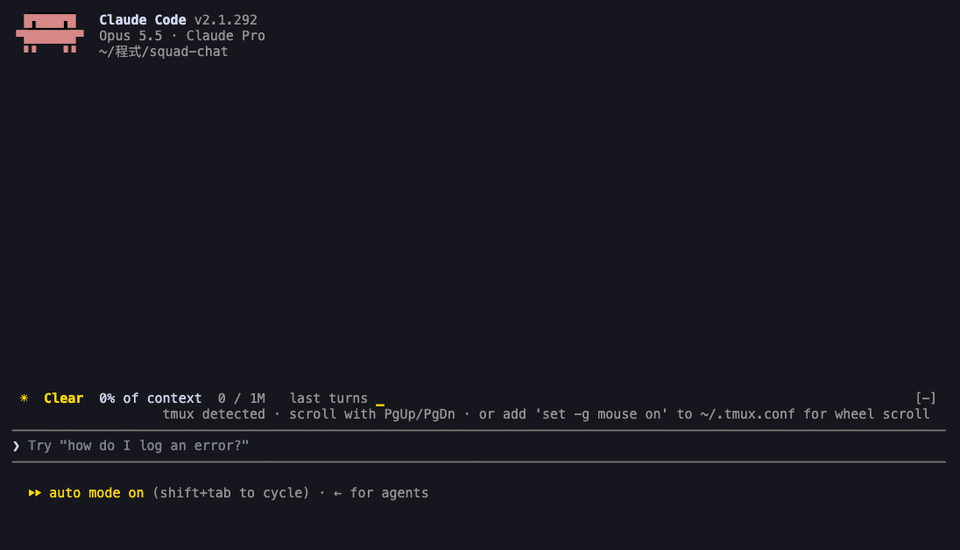
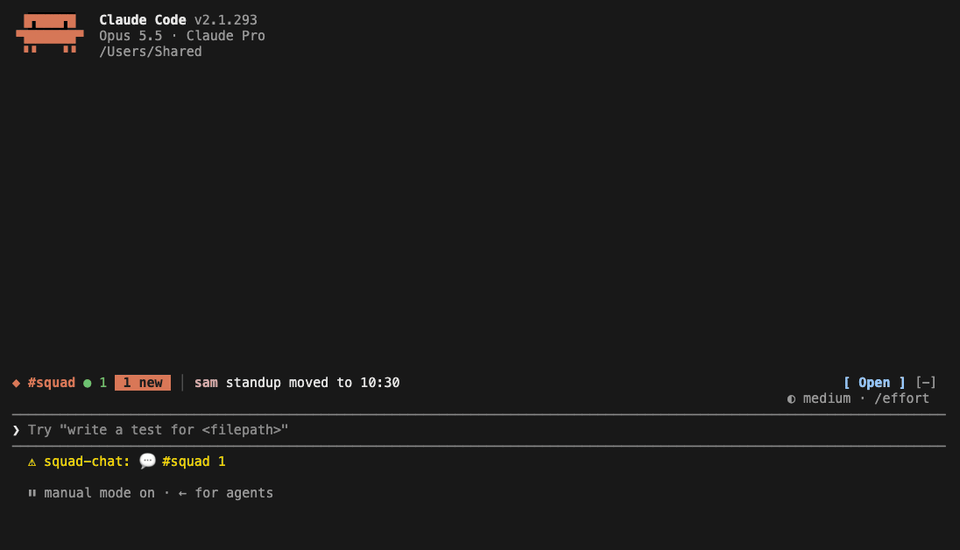

<a id="readme-top"></a>

<div align="center">

[![Stars][stars-shield]][stars-url]
[![Version][version-shield]][version-url]
[![CI][ci-shield]][ci-url]
[![License][license-shield]][license-url]
[![Made for Claude Code][made-for-shield]][made-for-url]
[![Node][node-shield]][node-url]
[![Views][views-shield]][views-url]

<br />

<a href="https://github.com/chrisluo5311/squad-chat">
  
</a>

<h1 align="center">squad-chat</h1>

<p align="center">
  <strong>Claude's cooking. Chat with your squad.</strong>
  <br />
  Friends online, right beside your Claude Code session. Zero tokens, zero leaks to Claude.
  <br />
  <a href="#usage"><strong>Explore the commands »</strong></a>
  <br />
  <br />
  <a href="#about-the-project">View Demo</a>
  ·
  <a href="https://github.com/chrisluo5311/squad-chat/issues/new?labels=bug">Report Bug</a>
  ·
  <a href="https://github.com/chrisluo5311/squad-chat/issues/new?labels=enhancement">Request Feature</a>
</p>

</div>

<details>
  <summary>Table of Contents</summary>
  <ol>
    <li>
      <a href="#about-the-project">About The Project</a>
      <ul>
        <li><a href="#built-with">Built With</a></li>
      </ul>
    </li>
    <li>
      <a href="#getting-started">Getting Started</a>
      <ul>
        <li><a href="#prerequisites">Prerequisites</a></li>
        <li><a href="#installation">Installation</a></li>
        <li><a href="#connect-to-a-server">Connect to a server</a></li>
      </ul>
    </li>
    <li>
      <a href="#usage">Usage</a>
      <ul>
        <li><a href="#first-run">First run</a></li>
        <li><a href="#commands">Commands</a></li>
        <li><a href="#layouts">Layouts</a></li>
        <li><a href="#two-accounts-on-one-computer">Two accounts on one computer</a></li>
      </ul>
    </li>
    <li><a href="#privacy--security">Privacy &amp; Security</a></li>
    <li><a href="#development">Development</a></li>
    <li><a href="#host-your-own-server">Host your own server</a></li>
    <li><a href="#roadmap">Roadmap</a></li>
    <li><a href="#license">License</a></li>
    <li><a href="#acknowledgments">Acknowledgments</a></li>
  </ol>
</details>

## About The Project

<div align="center">
  
  <sub>Signing in, joining a room, chatting while a friend is typing, switching rooms when a new message comes in, and picking a new name with /chat-name.</sub>
</div>

<br />

squad-chat puts a group chat next to your Claude Code conversation. You keep working with Claude on the left while your friends' messages come in on the right.

* **Lives inside Claude Code.** One `/chat` command opens a pane: no browser tab, no extra app.
* **Never reaches Claude.** What you type in the pane never enters the conversation, and slash-command arguments are hidden from the model, so chatting costs no tokens.
* **Presence across rooms.** See who's online in every room you share and who's typing, with a status line for unread messages, an optional toast when someone @mentions you, and a do-not-disturb mode for when Claude is busy.
* **Your own server.** Each group of friends runs its own free Supabase project. There is no central service and no account with us.
* **Private rooms.** Rooms are joined with a passcode, and the database only shows a room's messages to its members.
* **Survives bad networks.** After a dropped connection, a closed laptop or a crashed process, it reconnects by itself and fetches exactly the messages you missed.
* **Fits any terminal.** Docked beside the transcript in a wide terminal, compact above the prompt in a narrow one, and a one-line summary when the pane is closed.

It is a Claude Code mod: a plugin of function hooks, plus a small Node process that holds the connection to Supabase. [docs/ARCHITECTURE.md](docs/ARCHITECTURE.md) explains how the pieces fit.

<p align="right">(<a href="#readme-top">back to top</a>)</p>

### Built With

[![JavaScript][js-shield]][js-url]
[![Node.js][nodejs-shield]][nodejs-url]
[![Supabase][supabase-shield]][supabase-url]
[![PostgreSQL][postgres-shield]][postgres-url]
[![esbuild][esbuild-shield]][esbuild-url]
[![Resend][resend-shield]][resend-url]

<p align="right">(<a href="#readme-top">back to top</a>)</p>

## Getting Started

### Prerequisites

* Claude Code 2.1.287 or newer, in the terminal. The desktop app can't start the chat's background process yet.
* Node 22 or newer on your `PATH`:
  ```sh
  node --version
  ```
* A server: one Supabase project per group of friends. Get its URL and key from whoever hosts it, or [host one yourself](#host-your-own-server).
* A terminal with truecolor, such as iTerm2, Ghostty, kitty or WezTerm.
* For the side-by-side layout: Claude Code's fullscreen layout (`/tui fullscreen`) and a terminal at least 110 columns wide.

> [!NOTE]
> Claude Code decides where the pane goes, not the mod. Below 110 columns the pane opens above the prompt in a compact layout. While it's closed, a one-line summary sits above the prompt with an **Open** button.

### Installation

The repository is its own plugin marketplace.

1. Add the marketplace and install the plugin:
   ```sh
   claude plugin marketplace add chrisluo5311/squad-chat
   claude plugin install squad-chat@squad-chat
   ```
   Or, from inside Claude Code:
   ```
   /plugin install squad-chat --marketplace chrisluo5311/squad-chat
   ```
2. Restart Claude Code, or run `/reload-plugins`.
3. [Connect to a server](#connect-to-a-server), then open the pane with `/chat`.

To update later:

```sh
claude plugin marketplace update squad-chat && claude plugin update squad-chat@squad-chat
```

If you host your group's server, also run `supabase db push` again from an updated clone, so the server has what the new version needs. For example, typing indicators need 0.5.0's database change.

To uninstall:

```sh
claude plugin uninstall squad-chat@squad-chat && claude plugin marketplace remove squad-chat
```

To try it without installing:

```sh
git clone https://github.com/chrisluo5311/squad-chat.git
claude --plugin-dir ./squad-chat/plugins/squad-chat
```

### Connect to a server

squad-chat has no central server. Each group of friends shares one Supabase project, its *server*: one person [hosts it](#host-your-own-server) on Supabase's free plan, and everyone else connects with two values from them:

* the project URL, such as `https://abcd1234.supabase.co`
* the project's **publishable** key, `sb_publishable_…` (safe to share, unlike the secret key, which you never share)

Set them when you install:

```sh
claude plugin install squad-chat@squad-chat \
  --config supabase_url=https://abcd1234.supabase.co \
  --config supabase_key=sb_publishable_...
```

or later, from `/config` in Claude Code (squad-chat's options), or from a shell:

```sh
echo '{"supabase_url":"https://abcd1234.supabase.co","supabase_key":"sb_publishable_..."}' \
  | claude plugin configure squad-chat@squad-chat --values-stdin
```

Until a server is set, the pane says so and shows these steps.

<p align="right">(<a href="#readme-top">back to top</a>)</p>

## Usage

### First run

1. `/chat` opens the pane.
2. Sign in, depending on how your server is set up:
   * **With a name:** type the name you want and press Enter. That's it.
   * **With your email:** type your email and press Enter, then type the code from the email.
3. Create a room and give its name and passcode to your friends. Type this in the pane:
   ```
   /room our-team some-passcode
   ```
   Your friends join with the same line.
4. Chat: type in the pane and press Enter. Esc goes back to the prompt.

> [!IMPORTANT]
> **An account made with just a name can't be recovered.** It has no email, so once you sign out, delete `~/.config/squad-chat` or switch computers, you can't sign back into it. Signing in again makes a new account: rejoin your rooms with their passcodes and you'll see their history again. Messages from the old account stay in the rooms until they expire after 30 days. Signing in by email doesn't have this problem.

<div align="center">
  
</div>

### Commands

| Command | What it does |
| --- | --- |
| `/chat` | Open the pane |
| `/say <message>` | Send a message to the current room from the prompt |
| `/room` | List your rooms |
| `/room <name>` | Switch to a room you're in (or click its tab) |
| `/room <name> <passcode>` | Create a room, or join a friend's |
| `/room leave <name>` | Leave a room. Rejoin any time with its passcode. |
| `/room delete <name>` | Delete a room you created, with all its messages, for everyone. Run it twice to confirm. |
| `/who` | Who's online, across all your rooms |
| `/chat-login <email>`, then `/chat-login <code>` | Sign in by email from the prompt instead of the pane |
| `/chat-login <name>` | Sign in with just a name, where the server allows it |
| `/chat-name <new name>` | Change your display name. Your friends see the new one right away. |
| `/chat-logout` | Sign out on this computer |
| `/chat notify on` / `off` | Toast when someone writes `@yourname` (off by default) |
| `/chat dnd on` / `off` / `auto` | Do not disturb: no toasts, a quiet band and status line, and friends see you as busy. `auto` turns it on while Claude works on something longer than 30 seconds, then sums up what you missed. |

The pane's input box takes `/room`, `/who`, `/name`, `/dnd`, `/logout` and `/help` too. Type passcodes there: it never touches the conversation.

<div align="center">
  
  <sub>Do not disturb: the band stays grey while sam writes, and one toast sums it up after.</sub>
</div>

### Layouts

| Where | What you see |
| --- | --- |
| Docked (fullscreen, ≥ 110 columns) | Room tabs, a FRIENDS card, and the room's messages as bubbles: yours on the right, theirs on the left, grouped by sender, with date labels and a **new** line where you stopped reading |
| Above the prompt (narrower) | The room, who's online, the last five messages and the input box |
| Pane closed | One line: the room, who's online, unread count, the latest message and **Open** |
| Status line | Unread counts per room, such as `💬 #team 3`, or `🔕 #team 3` during do not disturb |

<div align="center">
  
</div>

### Two accounts on one computer

Each account needs its own config folder. Start the second Claude Code with:

```sh
SQUAD_CONFIG_DIR=~/.config/squad-chat-b claude
```

Gmail delivers `you+b@gmail.com` to `you@gmail.com`, which makes a handy second account for trying it out.

<p align="right">(<a href="#readme-top">back to top</a>)</p>

## Privacy & Security

* **What Claude sees.** Nothing typed in the pane enters the conversation. The arguments of `/say`, `/room` and `/chat-login` are replaced with a placeholder before Claude Code stores the command, and command answers are notices the model never reads. Claude Code still keeps a slash command's raw text in one bookkeeping line of the local transcript on your own disk, so type passcodes in the pane if that matters to you.
* **What Claude reads from the room: nothing.** Your friends' messages, names and who's online are drawn in the pane, the band and the status line, and that's all. None of it goes into your prompts, the system prompt, tool results or the transcript, so a friend joking "delete the repo" can't turn into an instruction. A test sends exactly that kind of message and checks it never reaches the model.
* **Who sees your messages.** Only members of the room. Access is enforced in the database with row-level security, and you become a member only with the room's passcode. Five wrong passcodes lock you out for 15 minutes.
* **Who runs the server.** Your squad's server belongs to whoever hosts it, and they can read its database like any database admin. Pick a host you trust, or host it yourself.
* **What friends see.** Your display name (the name you picked, or the part of your email before the `@`) and whether you're online, or busy during do not disturb. Never your email.
* **What's stored.** Messages are deleted after 30 days. Your sign-in session is kept in `~/.config/squad-chat/session.json`, readable only by you, and `/chat-logout` removes it. An account made with just a name can't be signed back into once you sign out, so `/chat-logout` asks twice.
* **Abuse limits.** At most 10 messages per 10 seconds per person, and 500 characters per message.

<div align="center">
  
  <sub>sam tells Claude to delete the repo from the chat. Claude never sees it.</sub>
</div>

<br />

Found a security problem? Please report it privately, as described in [SECURITY.md](SECURITY.md).

<p align="right">(<a href="#readme-top">back to top</a>)</p>

## Development

Want to help? [CONTRIBUTING.md](CONTRIBUTING.md) covers setting up, the tests and how to send a pull request.

```sh
# The mod
claude plugin validate ./plugins/squad-chat   # check the manifest and hooks
claude plugin test ./plugins/squad-chat       # mod tests, against a fake bridge
claude --plugin-dir ./plugins/squad-chat      # run Claude Code with this checkout

# The bridge
cd plugins/squad-chat/bridge
npm install && npm run build                  # rebuild dist/bridge.mjs after editing src/
npm test                                      # two users, two bridges, local Supabase

# The database
supabase start                                # local stack on ports 56420-56429
supabase test db                              # pgTAP access-control tests
supabase db advisors --local --type all
```

To run the mod against the local stack, start Claude Code with:

```sh
SQUAD_SUPABASE_URL=http://127.0.0.1:56421 \
SQUAD_SUPABASE_KEY=<local publishable key from `supabase status`> \
SQUAD_CONFIG_DIR=$(mktemp -d) \
claude --plugin-dir ./plugins/squad-chat
```

Sign-in emails land in the local mail UI at http://127.0.0.1:56424.

| Path | Contents |
| --- | --- |
| `plugins/squad-chat/hooks/squad-chat.mjs` | Hooks: commands, pane, band, status line, the bridge client, keeping chat out of the conversation |
| `plugins/squad-chat/hooks/state.mjs` | State built from the bridge's events |
| `plugins/squad-chat/hooks/commands.mjs` | Slash commands and the pane's input box |
| `plugins/squad-chat/hooks/views.mjs` | The docked pane, the compact pane and the band |
| `plugins/squad-chat/hooks/theme.mjs` | Colors and glyphs |
| `plugins/squad-chat/bridge/src/` | The Node bridge (bundled into `bridge/dist/bridge.mjs`) |
| `plugins/squad-chat/tests/` | Mod tests |
| `bridge-tests/` | Bridge tests against a local Supabase |
| `supabase/migrations/`, `supabase/tests/` | Schema, RLS and pgTAP tests |
| `docs/ARCHITECTURE.md` | How it fits together, and why |

<p align="right">(<a href="#readme-top">back to top</a>)</p>

## Host your own server

One person per group does this, once. It fits in Supabase's free plan.

1. **Create a Supabase project** at [supabase.com](https://supabase.com/dashboard).
2. **Create the tables.** With the [Supabase CLI](https://supabase.com/docs/guides/local-development/cli/getting-started), from a clone of this repository:
   ```sh
   supabase link --project-ref <your-project-ref>
   supabase db push
   ```
3. **Lock down Realtime.** In the dashboard, under **Realtime → Settings**, turn off **Allow public access to channels**.
4. **Choose how people sign in.** You can turn on either or both.
   * **With a name (simplest, no email service).** Under **Authentication → Sign In / Providers**, turn on **Allow anonymous sign-ins**. Anyone can make an account this way, but rooms still need their passcode, so strangers see nothing. Supabase limits anonymous sign-ups to 30 per hour per IP address.
   * **With an email code.** Supabase sends the codes, but its built-in email only reaches your project's own team members (2 an hour), so connect an email service over SMTP. [Resend](https://resend.com) has a free tier, and Postmark, Amazon SES or your mail provider's SMTP work the same way. With Resend:
     1. In Resend, [add and verify a domain](https://resend.com/domains) you own, such as `mail.example.com`.
     2. Create an [API key](https://resend.com/api-keys) with **Sending access**, restricted to that domain.
     3. In Supabase, open **Authentication → Emails → SMTP Settings**, turn on **Enable custom SMTP**, and fill in:

        | Field | Value |
        | --- | --- |
        | Sender email | an address on your domain, such as `login@mail.example.com` |
        | Sender name | `squad-chat` |
        | Host | `smtp.resend.com` |
        | Port | `465` |
        | Username | `resend` |
        | Password | the Resend API key |

     4. Under **Authentication → Emails → Templates**, edit **Confirm signup** and **Magic Link** so they show the code. For example, subject `Your squad-chat code` and body:
        ```html
        <h2>squad-chat</h2>
        <p>Your sign-in code:</p>
        <p style="font-size:28px;font-weight:bold;letter-spacing:4px">{{ .Token }}</p>
        <p>Type it into Claude Code. It expires in one hour.</p>
        ```
     5. Try it: sign in with your own email. Each code shows up under **Emails** in Resend's dashboard, with its delivery status.
5. **Share the server** with your friends: the project URL and the publishable key, from **Project Settings → API Keys**. Everyone, you included, [connects with them](#connect-to-a-server).

<p align="right">(<a href="#readme-top">back to top</a>)</p>

## Roadmap

- [x] Supabase backend: rooms with passcodes, RLS, rate limits, 30-day retention
- [x] Email-code sign-in and a Node bridge for Realtime presence and messages
- [x] Catch-up after network drops, and a watchdog for stuck reconnects
- [x] Docked pane, compact pane, one-line band and status line
- [x] Chat bubbles, room tabs, unread markers and @mention toasts
- [x] Leave and delete rooms
- [x] Bring your own server, with sign-in by name or by email code
- [x] `/chat-name` to change your display name
- [x] Typing indicators
- [x] Do not disturb, by hand or while Claude works
- [ ] A polling mode for the Claude Code desktop app, which can't start the bridge

See the [open issues](https://github.com/chrisluo5311/squad-chat/issues) for proposed features and known issues.

<p align="right">(<a href="#readme-top">back to top</a>)</p>

## License

Distributed under the MIT License. See [`LICENSE`](LICENSE) for more information.

<p align="right">(<a href="#readme-top">back to top</a>)</p>

## Acknowledgments

* [Supabase](https://supabase.com), for auth, Postgres and Realtime
* [Resend](https://resend.com) (optional), for delivering sign-in codes on servers that use email sign-in
* [glowup](https://github.com/NovusEdge/glowup), whose classic pack inspired the palette and card layout
* [Shields.io](https://shields.io) and [Hits](https://hits.sh), for the badges
* [Best-README-Template](https://github.com/othneildrew/Best-README-Template), for this README's layout

<p align="right">(<a href="#readme-top">back to top</a>)</p>

<!-- MARKDOWN LINKS & IMAGES -->
[stars-shield]: https://img.shields.io/github/stars/chrisluo5311/squad-chat?style=for-the-badge&logo=github&color=f5c542
[stars-url]: https://github.com/chrisluo5311/squad-chat/stargazers
[version-shield]: https://img.shields.io/badge/dynamic/json?style=for-the-badge&label=version&color=d97757&url=https%3A%2F%2Fraw.githubusercontent.com%2Fchrisluo5311%2Fsquad-chat%2Fmain%2Fplugins%2Fsquad-chat%2F.claude-plugin%2Fplugin.json&query=%24.version
[version-url]: plugins/squad-chat/.claude-plugin/plugin.json
[ci-shield]: https://img.shields.io/github/actions/workflow/status/chrisluo5311/squad-chat/ci.yml?branch=main&style=for-the-badge&label=CI&logo=githubactions&logoColor=white
[ci-url]: https://github.com/chrisluo5311/squad-chat/actions/workflows/ci.yml
[license-shield]: https://img.shields.io/badge/license-MIT-3da639?style=for-the-badge
[license-url]: LICENSE
[made-for-shield]: https://img.shields.io/badge/made%20for-Claude%20Code-d97757?style=for-the-badge&logo=claude&logoColor=white
[made-for-url]: https://claude.com/claude-code
[node-shield]: https://img.shields.io/badge/node-%E2%89%A5%2022-6cc070?style=for-the-badge&logo=nodedotjs&logoColor=white
[node-url]: https://nodejs.org
[views-shield]: https://hits.sh/github.com/chrisluo5311/squad-chat.svg?style=for-the-badge&label=views&color=e2b86b
[views-url]: https://hits.sh/github.com/chrisluo5311/squad-chat/
[js-shield]: https://img.shields.io/badge/JavaScript-F7DF1E?style=for-the-badge&logo=javascript&logoColor=black
[js-url]: https://developer.mozilla.org/docs/Web/JavaScript
[nodejs-shield]: https://img.shields.io/badge/Node.js-339933?style=for-the-badge&logo=nodedotjs&logoColor=white
[nodejs-url]: https://nodejs.org
[supabase-shield]: https://img.shields.io/badge/Supabase-3ECF8E?style=for-the-badge&logo=supabase&logoColor=white
[supabase-url]: https://supabase.com
[postgres-shield]: https://img.shields.io/badge/PostgreSQL-4169E1?style=for-the-badge&logo=postgresql&logoColor=white
[postgres-url]: https://www.postgresql.org
[esbuild-shield]: https://img.shields.io/badge/esbuild-FFCF00?style=for-the-badge&logo=esbuild&logoColor=black
[esbuild-url]: https://esbuild.github.io
[resend-shield]: https://img.shields.io/badge/Resend-optional-000000?style=for-the-badge&logo=resend&logoColor=white
[resend-url]: https://resend.com
