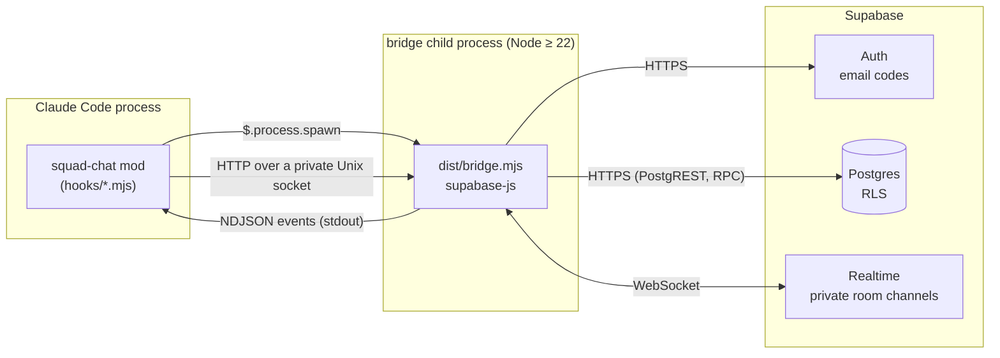

# Architecture

How squad-chat fits together, and why it's built this way. For using it, see the [README](../README.md).

## Overview



* **The mod** (`plugins/squad-chat/hooks/`) runs inside Claude Code. It draws the pane, the band above the prompt and the status line, registers the commands, and keeps chat out of the conversation.
* **The bridge** (`plugins/squad-chat/bridge/`) is a Node child the mod starts. It holds the Supabase session and the Realtime connection, because the mod runtime has no WebSocket and can't load npm packages.
* **Supabase** stores profiles, rooms, members and messages behind row-level security, and pushes presence and new messages over private Realtime channels.

## Why a bridge process

These findings come from the Phase 0 spike on Claude Code 2.1.291:

| Question | Answer |
|---|---|
| Can the pane take keyboard input? | Yes. An `Input` element with `onSubmit`, in a pane opened with `focus`. |
| Can background events redraw the pane? | Yes. The bridge's NDJSON on stdout → `$.ui.invalidate("ui.render")`. |
| Realtime without WebSocket? | Mods have no WebSocket, so a Node child (`$.process.spawn`) holds the connection. The mod controls it over HTTP on a private Unix socket (`$.http.fetch` with `socketPath`, directory `0700`, per-run token). |
| Is there a reliable "session ended" event? | `session.end` exists but has a short time budget, so it is best effort. The bridge also exits by itself within about 5 s when its parent dies (it watches `ppid`), and presence relies on the dropped connection. |
| Does chat leak into Claude's context? | Text typed in the pane never enters the transcript. A slash command is recorded as a user row with its arguments, so the mod rewrites the arguments of `/say`, `/room` and `/chat-login` in `session.append`, failing closed. Verified headless: the model can't see them. |

One rule of our own comes first: **what arrives from a room never enters the model's context.** The mod has no `prompt.submit`, `prompt.compose` or `tool.call` hook, and nothing it receives from the bridge is appended to the session. Friends' messages are drawn, never read by Claude, so one that reads like an instruction stays a chat message. If a feature ever needs Claude to read a room (say, "summarize what I missed"), the person has to ask for it each time, and the text goes in as a clearly marked block of untrusted data, never as part of the prompt. `room messages never reach the model` in the mod tests guards this.

Two rules of the mod runtime shape the code:

* `$` is never followed across an import, so everything that touches the engine lives in `hooks/squad-chat.mjs`. `state.mjs`, `commands.mjs`, `views.mjs` and `theme.mjs` are plain logic. The hooks module hands them a `call(path, body)` function, a `say(text)` function and the surface's element table.
* `Text` takes no flex props. A tree with one is refused whole and the engine draws its own, so anything that must not shrink is wrapped in a `Box`.

## Backend

`supabase/migrations/` holds the schema:

* **Tables:** `profiles` (display name from the email's local part, made unique), `rooms` (bcrypt passcode hash, never readable by clients), `room_members` (read markers), `messages` (each `text`, or a shared `code` or `diff` snippet with an optional language tag) and `presence_heartbeats`.
* **Access:** RLS on every table, column-level grants to `authenticated` only, nothing for `anon`. You see a room, its members and its messages only while you are a member.
* **Accounts:** a profile is created for every new user, named after the email's local part, or for an anonymous account after the name it picked (made unique with `-2`, `-3`, …).
* **Joining:** only through `join_room(slug, passcode)`, which creates the room if it doesn't exist and locks a caller out for 15 minutes after 5 wrong passcodes. Privileged helpers live in an unexposed `private` schema.
* **Deleting:** only the room's creator can delete it, and its members and messages go with it.
* **Limits:** a chat message is at most 500 characters, a snippet 8000 characters and 200 lines. A trigger caps each user at 10 messages per 10 seconds, and at 3 snippets a minute. `pg_cron` deletes messages older than 30 days.
* **Renaming:** people may change only their own display name, and names stay unique.
* **Realtime:** private `room:<uuid>` channels. Policies on `realtime.messages` let only members receive a room's channel, track presence on it, or broadcast on it (typing indicators). New messages arrive through `postgres_changes`, filtered by the table's own RLS.

`supabase/tests/rls.test.sql` checks all of this with pgTAP: non-members see nothing, nobody can post as someone else or backdate a message, wrong passcodes fail and lock out, the flood limit holds, only creators delete rooms.

There is no central server: each group runs its own Supabase project, and the plugin's options (`supabase_url`, `supabase_key`, from `userConfig`) point at it. The mod passes them to the bridge as `SQUAD_SUPABASE_URL` and `SQUAD_SUPABASE_KEY`. Unset options leave those environment variables alone, which is how local development points at `supabase start`. With neither set, the bridge exits with an `unconfigured` error and the pane explains how to connect.

Two ways to sign in, both through Supabase Auth:

* **A name:** an anonymous account (`signInAnonymously`), its display name passed as user metadata and picked up by the `handle_new_user` trigger. Needs anonymous sign-ins switched on, and no email service.
* **An email code:** `signInWithOtp`, then `verifyOtp` with the 6-10 digit code. Supabase's built-in email only reaches the project's team, and new free projects can only change their templates once custom SMTP is set up, so this needs an SMTP provider and templates showing `{{ .Token }}`.

## Bridge

`plugins/squad-chat/bridge/src/`:

* `bridge.mjs`: the process. Control API over the Unix socket (`/login/name`, `/login/start`, `/login/verify`, `/logout`, `/name`, `/room`, `/room/select`, `/room/leave`, `/room/delete`, `/send`, `/typing`, `/status`, `/read`, `/who`, `/state`, `/sessions/beat`, `/fnroom/list`, `/fnroom/visible`, `/fnroom/refresh`, `/fnroom/action`, `/ping`, `/shutdown`), NDJSON events on stdout (`ready`, `auth`, `rooms`, `message`, `presence`, `typing`, `name`, `friends`, `status`, `sessions`, `fnrooms`, `fnroom`, `error`), and the parent watch. Without a server configured it still starts, for the heartbeats alone: it reports `unconfigured`, its `ready` says `chat: false`, and the chat routes answer 503.
* `chat.mjs`: everything Supabase. Sign-in with the emailed code, rooms, one private channel per room, catch-up, unread counts, heartbeats and the friends list.
* `sessions.mjs`: the heartbeat board for the Agents room (see [Built-in rooms](#built-in-rooms)).
* `rooms/`: the function rooms (see [Function rooms](#function-rooms)): `manifest.mjs` checks a room's manifest, `registry.mjs` loads the rooms and runs their providers, `net.mjs` holds what a provider may fetch, and `providers/` has one file per provider.
* `file-storage.mjs`: the session file, `~/.config/squad-chat/session.json`, written `0600` through a temp file and a rename.

Things that took a while to get right:

* **Catch-up without gaps.** Channels subscribe with `postgres_changes_options: { wait: true }`, so `SUBSCRIBED` means delivery is live. Only then does the bridge fetch what it missed (`id > lastSeenId`, with a small overlap, de-duplicated by id).
* **Reconnecting.** realtime-js retries once after the connection drops. If that attempt fails while the network is still down, the socket stays "connecting" forever. A watchdog forces `disconnect()` then `connect()` after 10 s offline, with backoff.
* **Unread counts.** The bridge owns them: the database's count when a room is first seen, then each live or caught-up message from someone else past the read marker. Recounting later would double what catch-up adds.
* **Presence.** Online means present in any room's channel, or a heartbeat newer than that person's last presence leave. Without that rule, a recent heartbeat kept someone "online" for minutes after they quit.
* **Typing.** Keystrokes in the pane reach the bridge at most every 2 seconds, and the bridge broadcasts at most that often per room. Receivers show someone as typing until their message arrives or 5 seconds pass. The broadcast carries only a user id, and the name comes from the receiver's own records, so nobody can type under a made-up name.
* **Do not disturb.** The mod decides when it holds: switched on, or `auto` and a Claude turn has run past 30 seconds (`turn.start`, then `turn.complete` of the main turn, not a subagent's). It tells the bridge through `/status`, and the bridge adds `status: "busy"` to what it tracks on every room channel, so roommates see it through presence at once. A restarted bridge starts out available, so the mod sends it again after sign-in.
* **Snippets.** `/chat-share` reads the session on the mod's side (`$.ui.selection()`, `$.session.messages()`, or `git diff HEAD` through `$.process.run` in the session's folder) and only reads it: nothing is added to the conversation. It shows a preview first and checks for likely secrets. The bridge sends it with `kind` `code` or `diff`, keeping indentation. A server that hasn't run the snippets migration has no `kind` or `lang` column: the bridge notices the missing column, reads messages without them, and refuses snippets with a hint to run `supabase db push`, so chat keeps working. The slash command is `/chat-share` because Claude Code has a `/share` of its own. Commands are registered one at a time, so a name Claude Code refuses costs only that command.
* **Renaming.** A new name goes to the database, then out through presence, so roommates see it at once. The bridge tells the mod when a known name changes, and the pane relabels messages already on screen.

`dist/bridge.mjs` is one file bundled by esbuild and committed, so installing the plugin needs no `npm install`.

## Built-in rooms

The Usage, Git and Agents tabs are drawn by the mod from what it can read on this computer. They add no tables and need no sign-in.

* **Usage.** `session.measure` pushes context, rate limits and cost whenever they move, and `$.session.usage()` reads them when the room opens (with `breakdown: "summary"` for the context breakdown, estimated locally at no cost). `turn.complete` resolves with each turn's token usage, the main loop's and every subagent's, which gives the cache hit ratio. A `tool.call` hook times each call around `next(e)` and passes the result through unchanged. It never denies a call, and its `.catch` replays the call's own result. `agent.spawn` and `$.agent.list()` give the subagents and their status. All of it lives in `metrics.mjs` as plain data.
* **Git.** `github.mjs` runs `git status --porcelain=v2 --branch` and a handful of `gh … --json` calls in parallel through `$.process.run` in the session's folder, as the person is already signed in to `gh`. It polls every minute while the room is on show and every five minutes otherwise, and once more a few seconds after a `git push` or `gh pr create` goes through the Bash tool. A failed refresh keeps the last snapshot, marked stale. Comparing two snapshots gives the toasts: checks failing, a review asked of you, your PR approved, merged or in conflict.
* **Agents.** Each session's mod builds a heartbeat (`sessions.mjs`): folder name, branch, model, what it's doing, its subagent tree and its last dozen tool calls, each summarized in a few words with secret-looking text masked. It posts it to its bridge at most once a second while things change, and every ten seconds otherwise. The bridge writes it to `/tmp/squad-chat-<uid>/sessions/<session id>.json` (folder `0700`, file `0600`, through a temp file and a rename), watches the folder, and sends the mod a `sessions` event with every live heartbeat. A file is dropped when its bridge's pid is gone or it hasn't been written for 30 seconds, and a bridge deletes its own file when it shuts down. The folder sits beside the sockets, not in the config folder, so sessions under different `SQUAD_CONFIG_DIR`s still see each other.
* **Drawing.** `sysviews.mjs` builds each room from the same rounded card as the chat, with `widgets.mjs` for eighth-block meters, sparklines, stat tiles and rows whose fixed parts never shrink. `stackCards` places cards by priority in the height the dock has and names the ones that didn't fit. One loop in the mod ticks every second: a redraw while something runs (spinners and timers), the subagents' status, the heartbeat and the Git poll.

## Function rooms

A function room is a room drawn from data, not from code of its own: a manifest, `rooms/<id>/room.json`, names its providers, the hosts they may reach and a layout. Snippets is the first. The manifest is data: nothing in it runs, so a room someone else wrote can't do more than the providers squad-chat ships allow.

```jsonc
{
  "schema": 1, "id": "snippet", "version": "1.0.0", "name": "Snippets", "icon": "⌘", "color": "amber",
  "permissions": { "hosts": [] },
  "providers": [{ "id": "list", "type": "local-list", "params": { "max": 200 } }],
  "layout": {
    "cards": [{ "title": "SNIPPETS", "meta": "{list.count} saved",
                "body": { "type": "list", "items": "list.items", "title": "name", "tag": "lang", "copy": "body", "share": "body" } }],
    "band": "{list.count} snippets"
  }
}
```

* **Where rooms come from.** The bridge reads the rooms squad-chat ships (`plugins/squad-chat/rooms/`, passed as `SQUAD_ROOMS_DIR`), then any in `~/.config/squad-chat/rooms/`, which can't take a shipped room's id. `manifest.mjs` checks each one: its id, name, icon and color, that every provider exists, the hosts, and that the layout uses only known widgets with plain paths. One that doesn't check out is skipped, and the reasons go to the debug log.
* **Providers.** Each is a module in `bridge/src/rooms/providers/` with a `type`, the `hosts` it may ever reach, `fetch(params, ctx)` for its data and named `actions` (Snippets has `add`, `rename` and `delete`). `ctx.fetch` reaches only the hosts both the provider and the manifest name, within 10 seconds and 1 MB, and refuses redirects. `ctx.dataDir` is the room's own folder under `~/.config/squad-chat/room-data/`. Every string in a provider's answer loses terminal escapes and control characters before it leaves the bridge. An action is looked up in a table of the ones the provider declared, never by a property name from the request.
* **One list, many sessions.** Every session's bridge can change the Snippets list and a room's settings, so each change holds a lock (`lock.mjs`: a folder made beside the file, which is atomic, with an `owner` file holding the holder's pid and a token). A lock is broken only when its holder's pid no longer runs, never for being slow, by renaming it aside so that only one waiter can, and the winner puts it back if what it moved turns out to be live. Releasing removes a lock only while it's still the holder's. A list it can't read is reported and left alone: only a missing file counts as empty. A provider asked to run while it's running runs once more afterwards, so an action's change is never overwritten by an older answer. Settings are read again only when the file's inode or mtime changes.
* **Settings.** A manifest may declare up to 8 settings (`list`, `enum`, `string`, `bool` or `int`, each with a default), and a provider's params name one as `"$settings.<key>"`. `/chat set <room> <key> <value>` (or `/set` in the room) sends what was typed to `/fnroom/settings`, where the bridge reads it as the setting's kind (a list takes `a, b`, `+c` or `-a`), checks it, keeps the changed ones in the room's `settings.json` (0600) and runs the room again. A list of URLs must stay on the room's hosts. The bridge reports each room's values as an `fnsettings` event.
* **Rooms that go online** (Weather and Tech News so far) are off until `/chat rooms +name`, which names the hosts they reach. Weather's `open-meteo` provider looks a city up once, then fetches its forecast and air quality. `hn` reads Hacker News's Firebase API. `rss` reads RSS and Atom without an XML library. A feed reader goes wherever its room points it, so it declares its hosts as `"*"` and the manifest's list alone decides.
* **Quotes.** The Stocks room's `quotes` provider asks TWSE's MIS service for Taiwan codes (both `tse_` and `otc_`, since a bare code could be either, and the answer says which) and Yahoo's chart endpoint for everything else and for every quote's intraday line. A market counts as open only when its data is from today and the clock is inside its session, as TWSE answers on holidays with the last trading day's prices. While every market is closed it reuses its last answer for 15 minutes. If TWSE fails, Yahoo's `.TW` quote stands in. A table column's `colorFrom` names a field holding a palette color, so each row's change can be red or green.
* **Any JSON API.** `http-json` reads one https URL on the room's hosts (`"*"`, like `rss`), its `{holes}` filled from `vars`, which are usually settings. It turns an object of objects (CoinGecko's prices, Frankfurter's rates) into rows, keeps them in a setting's order, and formats fields by path: `number`, `compact`, `percent`, `signed`, `signed-percent`, `date`, `age`. Each field gives a display string and its number, and a signed one an arrow and a palette color for `colorFrom`. A change that rounds to nothing shows flat. `$settings.<key>` is now filled at any depth of a provider's params, and the manifest check follows it there.
* **A manifest's alerts.** `alerts` watch each row's field (`rows` and `field`) or one `value`, past `above`, `below` or `beyond` a number or a setting, where a setting of 0 is off. The registry checks them on each provider's fresh data and adds them to its `alerts`, with ids prefixed `m:`, so the mod toasts them as it does a provider's own.
* **Controls.** A layout's `buttons` widget, a list row's `act` (Lo-fi's ▶) and the layout's `keys` (single keys typed in the room) each name one of the provider's actions, checked against it when the manifest loads. The mod sends them to `/fnroom/action`.
* **A process that keeps running.** Lo-fi's `player` provider starts one mpv per bridge, only on play, and it belongs to the room that last pressed play (another room using the provider sees nothing playing and can't drive it). A manifest's stations must be https and on the room's own hosts, checked with the manifest and again before playing, since mpv fetches them itself. It starts through `ctx.spawn`: `--idle --no-video`, an IPC socket in the bridge's short runtime folder, under a `sh` watchdog that stops mpv within a second of the bridge going away (a `kill -9` too), and in its own process group. It talks to mpv over the socket (`loadfile`, `cycle pause`, `add volume`, `get_property`), looks up a YouTube channel's live streams with yt-dlp when one is played, and checks whether Pixel Play's mpv is playing too. A provider's `close()` runs when the bridge shuts down, and stops the group.
* **Reading this computer.** Monitor's `sysinfo` provider runs commands through `ctx.run(argv)`: no shell, 3 seconds and 4 MB at most, and only commands named in the provider's own code, never in a manifest. `ctx.read(file)`, `ctx.cpus()` and `ctx.loadavg()` cover `/proc`, `/sys` and the CPU counters. Rates and charts need the sample before, so it keeps each room's last sample and 60 points of history in memory. On a Mac, temperatures and power by part come from macmon (`macmon pipe -s 1 -i 250`, about 0.4 s) when it's installed, since macOS keeps them from anything without root.
* **Alerts.** A provider's data may carry `alerts: [{ id, text }]`. The mod toasts each id once, again only after it has gone and come back, and not while do not disturb holds.
* **When they run.** The mod tells the bridge which function rooms have tabs and which is on show (`/fnroom/visible`, only when that changes). A provider runs when its room gets a tab, after each of its actions, on `/fnroom/refresh` (`r` in the room), and on its `interval`: `visible` while its room is on show, `background` otherwise. A failed run keeps the last data, marked stale, with the error.
* **Drawing.** `fnviews.mjs` fills the layout in from the providers' data: `list`, `table`, `tiles`, `meter` and `text` widgets, one to a card or a column of up to six, and a card with `when` shows only while that path has data (Monitor's GPU and battery cards), bound with paths such as `list.items` and templates such as `{list.count} saved`. One layout gives the docked cards (a long list gives up rows, "+ 3 more", before a card is left out), the inline pane, the band and the plain-text snapshot `/chat-share <room>` posts.
* **Tabs.** Function rooms sit after the built-in ones. `/chat rooms` takes both, with `+name` and `-name`. A room that's new in a version gets its tab once, even for people who chose their tabs before (`roomsOffered` in `$.store`). Taken away, it stays away.

### The room store

Rooms anyone writes live in the repository's `rooms/`, one folder each, with an `index.json` that `rooms/build-index.mjs` builds: each room's id, name, version, `minSquadChat`, hosts, providers and sha256. CI runs it with `--check`, so a room that doesn't check out, or an index that's out of date, fails the pull request. The docs site makes its Room store page from the same index.

The bridge's `store.mjs` reads the index from `raw.githubusercontent.com` (`SQUAD_ROOM_STORE` points elsewhere, for tests) through the same limited fetch as the providers, and caches it for 10 minutes. `/store/preview` downloads a room's `room.json`, checks its sha256 against the index, runs the manifest check, and compares its id, version and `minSquadChat` with the index and with this squad-chat. It holds that copy, and says which hosts it reaches and which are new since the installed version. `/store/install` writes the held copy, by its hash, to `~/.config/squad-chat/rooms/<id>/room.json` (0600), and the registry reads its folders again. `/store/uninstall` removes the room and its `room-data`, and refuses a shipped room. The registry also skips any room whose `minSquadChat` is newer than this squad-chat, read from `plugin.json`.

The mod's `/chat install` and `/chat uninstall` take two runs a minute apart. `/chat update` goes straight through unless the new version reaches new hosts. An installed room gets a tab, an uninstalled one loses it.

The sha256 catches a download that went wrong, not a store that lies, since both come from one place. What keeps a store room safe is that a manifest can't run code, can't reach a host it doesn't name, and is shown, hosts and all, before it's installed.

## Function rooms: Phase 0

Function rooms are rooms you install: a JSON manifest drawn with the built-in rooms' widgets, fed by data providers that run in the bridge. A manifest never runs code. These findings come from the Phase 0 spike on Claude Code 2.1.293, macOS 27 on an M2 Max, Node 22:

| Question | Answer |
|---|---|
| Will more tabs fit? | They already wrap (`flexWrap: "wrap"`). With nine rooms and three chat rooms they take three rows at the dock's usual 40-56 columns, two at 80. Drawing every room but the one on show as its icon alone brings that to two rows at 40 columns. Function rooms get icon tabs, with a `Select` for the rest if even that runs long. |
| Can the pane edit a multi-line snippet? | No. `Input` is one line, and `Box` clips (`overflow: "hidden"`) without scrolling. Snippets are added from the selection or Claude's last code block, as `/chat-share` reads them, and only named or renamed in the pane. |
| What can Monitor read without sudo? | CPU from `os.cpus()` deltas. Memory from `vm_stat`, `sysctl vm.swapusage` and `kern.memorystatus_level` (pressure). Network from `netstat -ib` deltas. Disk from `df -k` and `iostat`. Battery from `pmset -g batt`. The power coming in (`SystemPowerIn`, in mW) from `ioreg -rn AppleSmartBattery`. GPU use (`Device Utilization %`) from `ioreg -rc IOAccelerator`. Each takes a few milliseconds. |
| And temperatures and power by part? | Not without help. `powermetrics` needs root, and `ioreg` exposes no CPU, GPU or battery temperature on Apple Silicon. [macmon](https://github.com/vladkens/macmon) 0.9 (MIT, `brew install macmon`) reads them without sudo: `macmon pipe -i <ms>` prints one JSON line per sample with CPU and GPU temperature, power for the CPU, GPU, ANE and whole system, each core's load and frequency, fans, RAM and swap. Left running at a 2-second interval it used no measurable CPU and 18 MB. Monitor runs it as a child through the same watchdog as mpv when it's installed, and leaves those cards out when it isn't. |
| Can the bridge play music? | Yes, the way Pixel Play does: `mpv --idle --no-video --input-ipc-server=<socket>`, driven with JSON commands over the socket. A direct stream starts in about a second and names the song through `icy-title`. A YouTube live stream starts in about two seconds through yt-dlp, its title as `media-title`. |
| Does mpv stop when the bridge dies? | Not by itself: after a `kill -9` of its parent it played on. Started through a small `sh` watchdog that checks the parent every second and stops mpv once it's gone, it exits within a second. |
| Socket paths? | macOS caps a Unix socket's path at 104 bytes, so mpv's socket goes in the bridge's short `/tmp/squad-chat-<uid>/` folder, like the others. |
| Lo-fi links that last? | YouTube live streams change id: lofi girl's best-known one now answers "not available". The room lists a channel's current streams (`yt-dlp --flat-playlist <channel>/streams`) instead of keeping ids. |
| Which stock sources work without a key? | TWSE's MIS endpoint (`getStockInfo.jsp?ex_ch=tse_2330.tw\|otc_6488.tw`) for Taiwan, about 130 ms, and twenty requests in a burst all answered. Yahoo's chart endpoint (`/v8/finance/chart/<symbol>`) for the US and Taiwan alike, about 100 ms, also twenty in a burst. Yahoo's `/v7/finance/quote` now answers 401, so it's out. |
| When is a market open? | Hours alone don't tell. On a holiday TWSE keeps answering with the last trading day's prices (`d` is that date), so a quote counts as live only when its date is today in the exchange's time zone. Yahoo's `currentTradingPeriod` gives the session's start and end. |

## Tests

| Suite | Runs | Covers |
|---|---|---|
| `supabase/tests/rls.test.sql` | `supabase test db` | Access control, limits, cascades (pgTAP) |
| `bridge-tests/` | `npm test` in `plugins/squad-chat/bridge` | Two users, two real bridges, local Supabase: sign-in, passcodes, presence, messages, a network drop through a cuttable proxy, restarts, unread, deleting rooms, `kill -9` |
| `bridge-tests/sessions.test.mjs` | the same `npm test`, no Supabase needed | Two bridges without a server sharing heartbeats, a dead session dropped, refusing bad heartbeats, cleaning up on shutdown |
| `bridge-tests/fnrooms.test.mjs` | the same `npm test`, no Supabase needed | Loading rooms and refusing bad manifests, the Snippets list (add, rename, delete, a private file, kept across restarts), fetch held to a room's hosts, time and size, and strings cleaned of terminal escapes |
| `plugins/squad-chat/tests/` | `claude plugin test ./plugins/squad-chat` | The mod against a fake bridge: sign-in, views, band, status line, read markers, mentions, tabs, room commands, room text never reaching the model, the built-in rooms (usage figures, tool timing passed through untouched, `gh` results and toasts, other sessions, snapshots), and function rooms (the Snippets room, `/snippet`, icon tabs, the band, stale data) |
