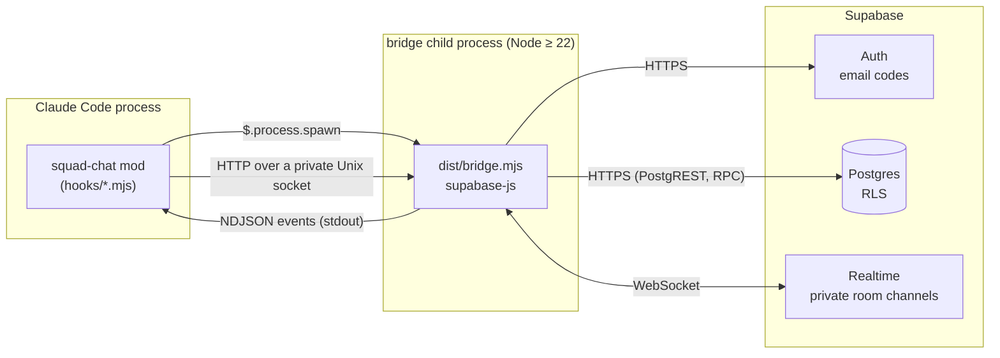

# Architecture

How squad-chat fits together, and why it's built this way. For using it, see the [README](../README.md).

## Overview

* **The mod** (`plugins/squad-chat/hooks/`) runs inside Claude Code. It draws the pane, the band above the prompt and the status line, registers the commands, and keeps chat out of the conversation.
* **The bridge** (`plugins/squad-chat/bridge/`) is a Node child the mod starts. It holds the Supabase session and the Realtime connection, because the mod runtime has no WebSocket and can't load npm packages.
* **Supabase** stores profiles, rooms, members and messages behind row-level security, and pushes presence and new messages over private Realtime channels.

## Why a bridge process

These findings come from the Phase 0 spike on Claude Code 2.1.291:

| Question | Answer |
|---|---|
| Can the pane take keyboard input? | Yes. An `Input` element with `onSubmit`, in a pane opened with `focus`. |
| Can background events redraw the pane? | Yes. The bridge's NDJSON on stdout → `$.ui.invalidate("ui.render")`. |
| Realtime without WebSocket? | Mods have no WebSocket, so a Node child (`$.process.spawn`) holds the connection. The mod controls it over HTTP on a private Unix socket (`$.http.fetch` with `socketPath`, directory `0700`, per-run token). |
| Is there a reliable "session ended" event? | `session.end` exists but has a short time budget, so it is best effort. The bridge also exits by itself within about 5 s when its parent dies (it watches `ppid`), and presence relies on the dropped connection. |
| Does chat leak into Claude's context? | Text typed in the pane never enters the transcript. A slash command is recorded as a user row with its arguments, so the mod rewrites the arguments of `/say`, `/room` and `/chat-login` in `session.append`, failing closed. Verified headless: the model can't see them. |

Two rules of the mod runtime shape the code:

* `$` is never followed across an import, so everything that touches the engine lives in `hooks/squad-chat.mjs`. `state.mjs`, `commands.mjs`, `views.mjs` and `theme.mjs` are plain logic. The hooks module hands them a `call(path, body)` function, a `say(text)` function and the surface's element table.
* `Text` takes no flex props. A tree with one is refused whole and the engine draws its own, so anything that must not shrink is wrapped in a `Box`.

## Backend

`supabase/migrations/` holds the schema:

* **Tables:** `profiles` (display name from the email's local part, made unique), `rooms` (bcrypt passcode hash, never readable by clients), `room_members` (read markers), `messages` and `presence_heartbeats`.
* **Access:** RLS on every table, column-level grants to `authenticated` only, nothing for `anon`. You see a room, its members and its messages only while you are a member.
* **Accounts:** a profile is created for every new user, named after the email's local part, or for an anonymous account after the name it picked (made unique with `-2`, `-3`, …).
* **Joining:** only through `join_room(slug, passcode)`, which creates the room if it doesn't exist and locks a caller out for 15 minutes after 5 wrong passcodes. Privileged helpers live in an unexposed `private` schema.
* **Deleting:** only the room's creator can delete it, and its members and messages go with it.
* **Limits:** a trigger caps each user at 10 messages per 10 seconds. `pg_cron` deletes messages older than 30 days.
* **Renaming:** people may change only their own display name, and names stay unique.
* **Realtime:** private `room:<uuid>` channels. Policies on `realtime.messages` let only members receive a room's channel, track presence on it, or broadcast on it (typing indicators). New messages arrive through `postgres_changes`, filtered by the table's own RLS.

`supabase/tests/rls.test.sql` checks all of this with pgTAP: non-members see nothing, nobody can post as someone else or backdate a message, wrong passcodes fail and lock out, the flood limit holds, only creators delete rooms.

There is no central server: each group runs its own Supabase project, and the plugin's options (`supabase_url`, `supabase_key`, from `userConfig`) point at it. The mod passes them to the bridge as `SQUAD_SUPABASE_URL` and `SQUAD_SUPABASE_KEY`. Unset options leave those environment variables alone, which is how local development points at `supabase start`. With neither set, the bridge exits with an `unconfigured` error and the pane explains how to connect.

Two ways to sign in, both through Supabase Auth:

* **A name:** an anonymous account (`signInAnonymously`), its display name passed as user metadata and picked up by the `handle_new_user` trigger. Needs anonymous sign-ins switched on, and no email service.
* **An email code:** `signInWithOtp`, then `verifyOtp` with the 6-10 digit code. Supabase's built-in email only reaches the project's team, and new free projects can only change their templates once custom SMTP is set up, so this needs an SMTP provider and templates showing `{{ .Token }}`.

## Bridge

`plugins/squad-chat/bridge/src/`:

* `bridge.mjs`: the process. Control API over the Unix socket (`/login/name`, `/login/start`, `/login/verify`, `/logout`, `/name`, `/room`, `/room/select`, `/room/leave`, `/room/delete`, `/send`, `/typing`, `/read`, `/who`, `/state`, `/ping`, `/shutdown`), NDJSON events on stdout (`ready`, `auth`, `rooms`, `message`, `presence`, `typing`, `name`, `friends`, `status`, `error`), and the parent watch.
* `chat.mjs`: everything Supabase. Sign-in with the emailed code, rooms, one private channel per room, catch-up, unread counts, heartbeats and the friends list.
* `file-storage.mjs`: the session file, `~/.config/squad-chat/session.json`, written `0600` through a temp file and a rename.

Things that took a while to get right:

* **Catch-up without gaps.** Channels subscribe with `postgres_changes_options: { wait: true }`, so `SUBSCRIBED` means delivery is live. Only then does the bridge fetch what it missed (`id > lastSeenId`, with a small overlap, de-duplicated by id).
* **Reconnecting.** realtime-js retries once after the connection drops. If that attempt fails while the network is still down, the socket stays "connecting" forever. A watchdog forces `disconnect()` then `connect()` after 10 s offline, with backoff.
* **Unread counts.** The bridge owns them: the database's count when a room is first seen, then each live or caught-up message from someone else past the read marker. Recounting later would double what catch-up adds.
* **Presence.** Online means present in any room's channel, or a heartbeat newer than that person's last presence leave. Without that rule, a recent heartbeat kept someone "online" for minutes after they quit.
* **Typing.** Keystrokes in the pane reach the bridge at most every 2 seconds, and the bridge broadcasts at most that often per room. Receivers show someone as typing until their message arrives or 5 seconds pass. The broadcast carries only a user id, and the name comes from the receiver's own records, so nobody can type under a made-up name.
* **Renaming.** A new name goes to the database, then out through presence, so roommates see it at once. The bridge tells the mod when a known name changes, and the pane relabels messages already on screen.

`dist/bridge.mjs` is one file bundled by esbuild and committed, so installing the plugin needs no `npm install`.

## Tests

| Suite | Runs | Covers |
|---|---|---|
| `supabase/tests/rls.test.sql` | `supabase test db` | Access control, limits, cascades (pgTAP) |
| `bridge-tests/` | `npm test` in `plugins/squad-chat/bridge` | Two users, two real bridges, local Supabase: sign-in, passcodes, presence, messages, a network drop through a cuttable proxy, restarts, unread, deleting rooms, `kill -9` |
| `plugins/squad-chat/tests/` | `claude plugin test ./plugins/squad-chat` | The mod against a fake bridge: sign-in, views, band, status line, read markers, mentions, tabs, room commands |
